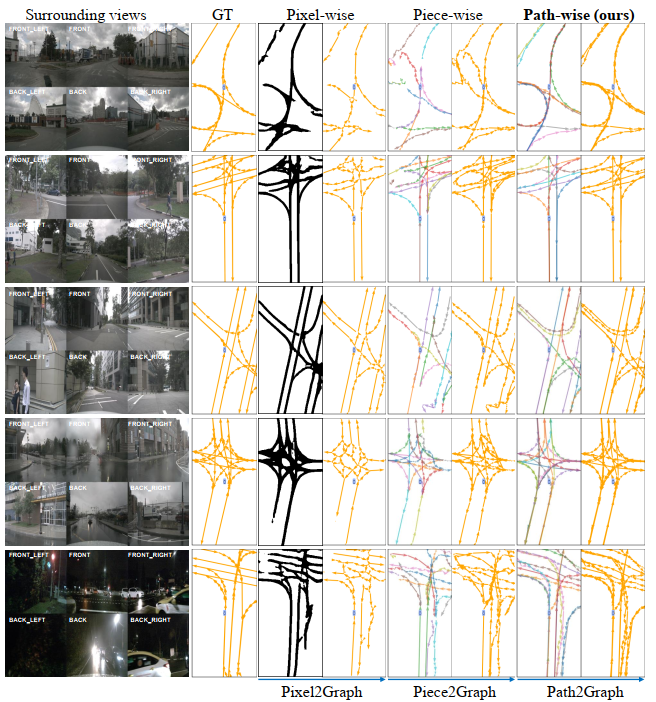

<div align="center">
<h1>Lane Graph as Path </h1>
<h3>Continuity-preserving Path-wise Modeling for Online Lane Graph Construction</h3>

[Bencheng Liao](https://github.com/LegendBC)<sup>1,2</sup> \*, [Shaoyu Chen](https://scholar.google.com/citations?user=PIeNN2gAAAAJ&hl=en&oi=sra)<sup>2</sup> \*, [Bo Jiang](https://github.com/rb93dett)<sup>2</sup>, [Tianheng Cheng](https://scholar.google.com/citations?user=PH8rJHYAAAAJ&hl=zh-CN)<sup>2</sup>, [Qian Zhang](https://scholar.google.com/citations?user=pCY-bikAAAAJ&hl=zh-CN)<sup>3</sup>, [Wenyu Liu](http://eic.hust.edu.cn/professor/liuwenyu/)<sup>2</sup>, [Chang Huang](https://scholar.google.com/citations?user=IyyEKyIAAAAJ&hl=zh-CN)<sup>3</sup>, [Xinggang Wang](https://xinggangw.info/)<sup>2 :email:</sup>
 
<sup>1</sup>  Institute of Artificial Intelligence, HUST, <sup>2</sup>  School of EIC, HUST,  <sup>3</sup> Horizon Robotics

(\*) equal contribution, (<sup>:email:</sup>) corresponding author.

ArXiv Preprint ([arXiv 2303.08815](https://arxiv.org/abs/2303.08815))

</div>


#


### News


* **`Aug. 31st, 2023`:** Code of LaneGAP is released together with MapTRv2 (https://github.com/hustvl/MapTR).
* **` Mar. 16th, 2023`:** We released our paper on Arxiv. Code/Models are coming soon. Please stay tuned! ☕️


## Introduction
Path is the primitive of lane graph. There is a gap between previous lane graph modelings and driving habit of human drivers, as well as the requirements of autonomous vehicles. To bridge this gap, we propose to model the lane graph in a novel path-wise manner, which well preserves the continuity of the lane and encodes traffic information for planning. We present a path-based online lane graph construction framework, termed LaneGAP.


<div align="center">

</div>


## Qualitative results on the whole nuScenes val set
Due to the limitation of file size, we split the video into five parts.
### Part 1/5


https://user-images.githubusercontent.com/31960625/225223313-20668f55-cfe9-462e-8e3e-d42c69c47647.mp4


### Part 2/5


https://user-images.githubusercontent.com/31960625/225223445-071beab0-70e7-4df6-9cc1-378a8635bf23.mp4


### Part 3/5


https://user-images.githubusercontent.com/31960625/225223644-9c58156d-e957-4cb7-8d95-e4ec4d6f8aed.mp4


### Part 4/5


https://user-images.githubusercontent.com/31960625/225223727-25503da7-34f8-4076-b410-d02662d3e1fe.mp4


### Part 5/5


https://user-images.githubusercontent.com/31960625/225223820-6c3ab56c-86a7-4e47-9c50-1d650f09b222.mp4


## Citation
If you find LaneGAP is useful in your research or applications, please consider giving us a star 🌟 and citing it by the following BibTeX entry.

```bibtex
 @article{lanegap,
  title={Lane Graph as Path: Continuity-preserving Path-wise Modeling for Online Lane Graph Construction},
  author={Bencheng Liao and Shaoyu Chen and Bo Jiang and Tianheng Cheng and Qian Zhang and Wenyu Liu and Chang Huang and Xinggang Wang},
  journal={arXiv preprint arXiv:2303.08815},
  year={2023}
}
```
